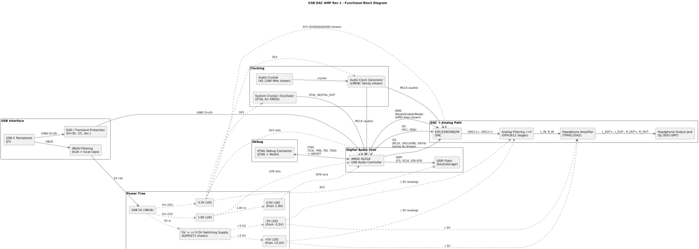
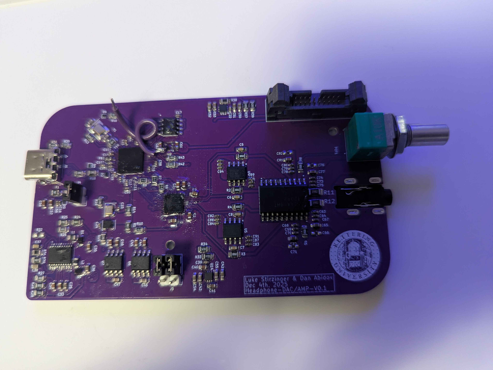

# I Built a Hi-Fi USB DAC/AMP From Scratch — Here's How the Design Came Together

I've been working on a compact, USB-C-powered DAC/AMP capable of 24-bit audio at 192 kHz. The goal was to prove that audiophile-grade performance doesn't require audiophile-grade pricing or a wall adapter — and to document the design decisions thoroughly enough that someone else could pick up where I left off. The first revision taught me a lot about what matters in a prototype. The second revision, currently in fabrication, applies every one of those lessons.

## The Problem Worth Solving

Most integrated DACs in laptops and phones are limited to 16-bit resolution at 44.1 kHz. That's the bare minimum for acceptable audio. At the other end, systems capable of 24-bit depth and sampling rates above 96 kHz are expensive, externally powered, and bulky. I wanted to land in the middle: a system that meets real hi-fi specs, runs entirely from USB bus power, and can drive anything from 10 Ω IEMs to 300 Ω over-ear headphones through a 3.5 mm balanced output.

The full requirement set:

- 24-bit resolution at 192 kHz sampling
- USB-C 2.0 input, no external power
- 3.5 mm balanced output
- 10 Ω to 300 Ω headphone impedance range
- Adjustable gain

## Selecting the Digital Audio Protocol

The first major design decision was how digital audio would move between ICs internally. I evaluated three protocols.

**SPI** is well-documented and widely supported, but it's a general-purpose bus protocol designed for multi-device topologies. The collision avoidance and bus arbitration features add overhead that provides no benefit when you're connecting exactly two devices on a short PCB trace.

**S/PDIF** (Sony/Philips Digital Interface) can run on a single coaxial or optical line, which makes it attractive for longer runs. However, the clock is embedded in the data stream, so the receiving device needs a PLL to recover it. That's added analog complexity and a potential jitter source — for a benefit I don't need on a board this small.

**I²S** (Inter-IC Sound) was developed specifically for short-distance audio interconnects between ICs. It uses a dedicated clock line, which means I can implement a high-frequency, low-jitter, low-phase-noise clock directly in the system without recovery circuitry. Published test data from other designers shows that I²S output produces virtually no harmonics beyond the intended signal frequency, while USB-delivered audio — which arrives in millisecond bursts rather than uniform bit-per-cycle streams — shows measurably more noise. I²S was the clear choice for this application.

## Component Selection and Rationale

With I²S as the internal protocol, I needed a USB-to-I²S bridge, a DAC, and a headphone amplifier.

### USB-to-I²S Bridge: XMOS XU316

I surveyed every viable option I could find. Qualcomm SOCs appear frequently in commercial DAC/AMPs, but they're oriented toward Bluetooth stacks and aren't available through legitimate consumer purchasing channels. Amanero bridges suffer from the same availability problem. STM32 microcontrollers can technically handle I²S, but their clocking scheme is relatively rigid — a concern when I didn't yet know exactly what clocking topology the final design would require.

The XMOS XU208 was the audiophile community's established choice, but it's now obsolete. Its replacement, the XU316, offers software-configurable peripherals, supports the full range from my target spec all the way up to 32-bit at 768 kHz (true lossless territory), and comes with a production-ready I²S driver in C. Each of its logical processors can be dedicated to a single interface, so one handles the USB PHY and another handles I²S output. The device requires external boot memory, which I'm providing with a W25Q32JV QSPI flash.

### DAC: ESS Sabre ES9039Q2M

When filtering I²S-capable DACs by supported sample rate and bit depth, the ESS Sabre line consistently surfaced — both in user community recommendations and in teardowns of commercial products. The ES9039Q2M is the two-channel variant, rated for up to 32-bit at 768 kHz. That far exceeds my 24-bit/192 kHz target, but it means the DAC won't be the limiting factor if I push the specs in a future revision. For reference, a comparable commercial unit using an XMOS and Sabre DAC retails for around $200.

### Headphone Amplifier: TPA6120

The TPA6120 from Texas Instruments is a current-feedback amplifier designed specifically for headphone driving. It covers the full 10 Ω to 300 Ω impedance range I need, and it's well-characterized in the datasheet with clear application circuits.

Before committing to a custom PCB, I purchased standalone evaluation boards for the XMOS and ES9039Q2M from AliExpress and tested them together to verify basic interoperability. This was a low-cost way to derisk the architecture before investing in layout and fabrication.

## Power Architecture

Running everything from USB bus power meant designing a multi-rail supply within the 5 V envelope. I used dedicated LDOs to generate 3.3 V, 1.8 V, and 0.9 V rails for the digital and mixed-signal sections. The headphone amplifier requires a differential supply, which I derived from a 5.5 V rail using an ADP5071 DC-DC converter, buffered through additional LDOs. I initially evaluated a ±12 V differential supply but rejected it — the output power would risk overdriving headphones at the lower impedance end of the target range.

## Grounding: Why I Didn't Split the Planes

This was one of the most consequential decisions in the layout. The traditional approach in audio PCB design is to separate analog and digital grounds, tying them at a single point near the power input. Many ICs even provide separate analog and digital ground pins to support this topology.

My research led me away from that practice. In theory, a split ground controls return current paths to prevent digital switching noise from coupling into analog signals. In practice — particularly at frequencies above 20 kHz — the split creates long, inconsistent return paths that actually *increase* conducted emissions. The physics is straightforward: at higher frequencies, return current follows the path of least impedance (directly beneath the trace), not the path of least resistance. A split ground forces that current to detour, widening the loop area and worsening the very noise it was supposed to prevent.

This position is backed by Rick Hartley, a well-known figure in RF PCB design, who states in a published talk that his first fix in nearly every conducted emissions case is removing the split planes. He cites a joke from a debugging specialty company: "What do we call an engineer who splits their grounds? A customer."

Instead, I implemented a continuous, unbroken ground plane on Layer 2 of a four-layer stackup. This provides a low-impedance return path directly beneath every trace and acts as a shield between signal layers. The analog and digital sections are physically separated on the board, so their return currents naturally stay in their respective regions without needing an artificial plane split. The full stackup:

- **Layer 1:** Top-side components and signal routing
- **Layer 2:** Continuous ground plane (unbroken)
- **Layer 3:** Power distribution
- **Layer 4:** Low-risk signal passthrough (digital signals below 750 kHz only)

Critical audio signals are never routed through vias to Layer 4. A via punches through the ground plane and brings the signal adjacent to the power layer — an unacceptable noise risk for analog audio.

## Analog Filter Design

The DAC output needs a low-pass filter to remove everything above the audible 20 kHz band. I initially designed a third-order Chebyshev filter using a single op-amp — an aggressive topology that looked excellent in LTspice simulation. However, I had concerns about stability in practice, particularly around the large resistor values in the feedback network.

A review of the TPA6120 datasheet and other manufacturer reference designs confirmed that the recommended approach is much simpler: a single op-amp stage (OPA1612) with a 2200 pF feedback capacitor in parallel with an 800 Ω resistor. Simulation confirmed a cutoff at approximately 20 kHz. It's less mathematically interesting than the Chebyshev, but it's stable, well-characterized, and trusted by the amplifier manufacturer. I went with the proven approach.

## PCB Layout Strategy

The schematic was built in KiCad using hierarchical sub-schematics — USB input, audio power rails, general power, DAC, headphone amp, clocking, and debug — each managed under Git for version control. Key layout decisions:

**Impedance control:** USB differential pairs are matched to 90 Ω with length-matched routing to minimize skew.

**Clock isolation:** Clock traces are significant EMI emitters. I isolated them from other signal routes on their respective layers while keeping trace lengths short to minimize propagation delay. This is a constant tradeoff — electromagnetic isolation wants distance, signal integrity wants short traces.

**Decoupling placement:** Every decoupling capacitor sits immediately adjacent to the power pin it serves. With the high-switching nature of several devices on this board, proper decoupling is the difference between clean logic levels and EMI-induced errors.

**Audio trace routing:** Analog audio traces are wider to support higher current and minimize voltage drops. Digital audio traces are narrower to maintain controlled impedance. All audio paths are kept as short as possible.

**Manufacturing limits:** The XMOS XU316's pin density forced some traces to 0.1 mm — the minimum width guaranteed by JLCPCB. That's within tolerance, but it's a known manufacturing risk point.

## Revision 1: What Worked and What Didn't

The noise mitigation strategies — continuous ground plane, decoupling placement, impedance-controlled routing, clock isolation — are consistent with techniques recommended for FCC emissions compliance. I'm confident in the signal integrity design.

The failures were all prototype-level oversights. The 0.9 V LDO had an incorrect footprint — the PCB physically couldn't accept the component. The VBUS copper pour on the USB-C connector was misconfigured, leaving a minimal electrical connection that compromised power delivery across the board. The XMOS never responded to the XTAG debugger. The analog stages were never tested because the digital front-end never came up.

The root cause was designing the board as a product rather than a prototype. I optimized for component density and noise performance at the expense of debuggability. There were no power rail LEDs, no test points on critical signals, no reset access for the microcontroller, and no power headers for isolating domains with external supplies. Every one of those omissions made troubleshooting harder than it needed to be.

## Revision 2: A Modular Architecture

Revision 2 is currently in fabrication, and it addresses every issue from Rev 1 with a fundamentally different board architecture.

The system is now split into two boards — a **daughter board** and a **carrier board** — connected through castellated pins.

### Daughter Board: Digital Domain

The daughter board contains all digital functionality: the XMOS XU316, QSPI flash, USB-C interface, clocking, and the I²S output stage. This is the noisiest section of the design — high-speed digital switching, USB PHY activity, and clock generation all live here. Isolating it onto its own PCB means I can validate the entire digital front-end independently before it ever touches the analog path. If the XMOS doesn't enumerate, I know exactly which board to probe without risking the analog section.

### Carrier Board: Analog Domain

The carrier board contains everything that needs to be low-noise: the ES9039Q2M DAC, the OPA1612 filter stage, the TPA6120 headphone amplifier, the analog power supply, and the 3.5 mm output jack. By keeping all sensitive analog circuitry on a dedicated board with its own unbroken ground plane and clean power distribution, I have much tighter control over the noise environment where it matters most.

### Why This Topology Helps Noise

The daughter board mounts to the **underside** of the carrier board. This isn't just a mechanical convenience — it places the digital noise sources on the opposite side of the carrier board's ground plane from the analog signal path. The same continuous ground plane that was already doing the heavy lifting in Rev 1 now sits physically *between* the two noise domains, acting as an additional shielding layer between the digital switching below and the analog signal path above.

### Why This Topology Helps Everything Else

Modularity solves nearly every debugging problem I had in Rev 1. If the XMOS firmware needs work, I can bench-test the daughter board alone. If I want to experiment with a different DAC or amplifier topology, I can swap carrier boards without redesigning the digital interface. If a footprint is wrong on one board, I don't refabricate both. And because each board has its own set of power rails, I can isolate and verify each power domain independently — something that was nearly impossible on the monolithic Rev 1 layout.

## Where This Is Headed

The boards are at the fabricator now. Once they arrive, the first milestone is confirming that the XMOS boots and enumerates over USB — the failure point from Rev 1. From there I'll verify I²S output on the daughter board, bring up the DAC on the carrier board, characterize the filter response, and measure the amplifier output across the full impedance range.

The component selection supports specs well beyond the current target. The noise mitigation strategy is grounded in current best practices rather than outdated convention. The modular architecture means I can iterate on either domain without starting from scratch. Rev 1 proved the design intent was sound — Rev 2 is built to prove it works.